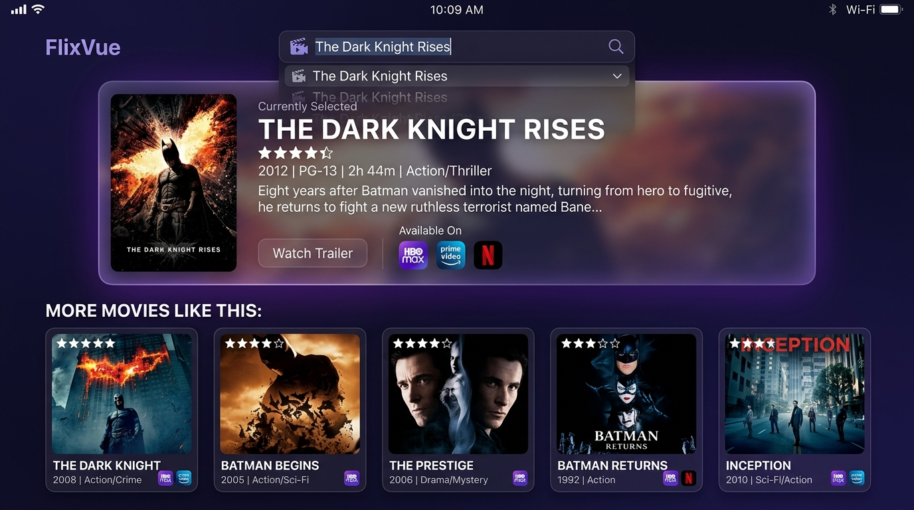
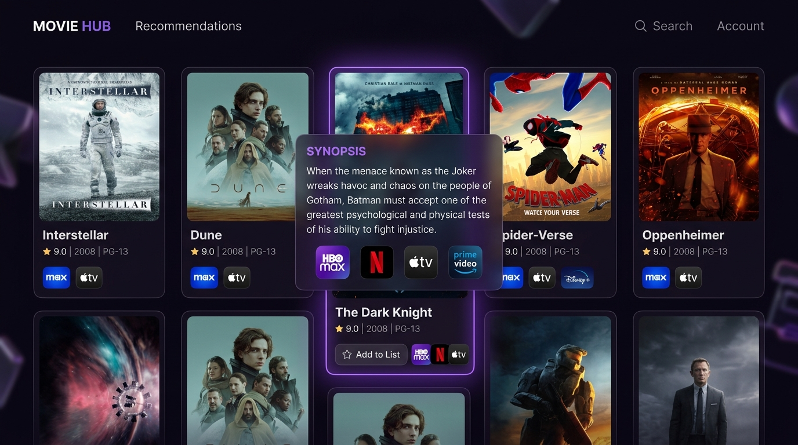
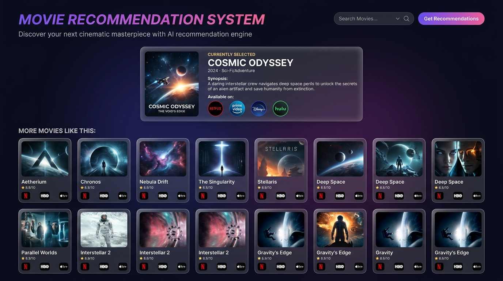

# 🎬 Glassmorphic Movie Recommendation System

[](https://github.com/23A9MQ040/Movie-Recommendation-system/)
[](https://streamlit.io/)
[](https://www.python.org/)
[](https://opensource.org/licenses/MIT)

An AI-powered, content-based Movie Recommendation System featuring a premium glassmorphic UI. This system analyzes similarity vectors across metadata (genres, keywords, cast, and crew) from the TMDB 5000 Movies dataset and presents recommendations dynamically with live posters and regional watch provider details via the TMDB API.

---

## 📸 Output & Application Previews

### 1. Recommendation Engine Output
> Displays the selected movie's metadata (synopsis, genre, year, available stream providers) and generates top 10 closely matching recommendations based on vector similarity.



### 2. Interactive Synopsis & Watch Provider Hover State
> Hovering over any movie card reveals a sleek glassmorphic overlay containing the plot synopsis and regional watch providers (Netflix, HBO Max, Prime Video, Apple TV).



### 3. Discovery Dashboard & 2x5 Grid Layout
> Responsive dark-mode interface with poster fallbacks and streaming icons for every recommendation.



---

## ✨ Features

- **Content-Based Filtering**: Recommends movies by calculating cosine similarity on TF-IDF vectors generated from merged metadata (genres, keywords, top 3 cast members, and directors).
- **Premium Glassmorphic UI**: Designed with custom CSS on Streamlit for a dark mode layout featuring blur backdrops, gradient accents, interactive hover card animations, and line-clamp handling for titles.
- **Dynamic TMDB Integration**:
  - **Live Movie Posters**: Fetches high-resolution posters directly from TMDB's image server.
  - **Synopsis Overlay**: Hovering over any recommended movie poster displays a sleek overlay with the movie's synopsis.
  - **Watch Providers**: Shows live streaming, renting, and buying provider badges (e.g., Netflix, Prime Video, Disney+) with regional intelligence (prioritizing India, falling back to US, then worldwide).
  - **Robust Fallbacks**: Graceful UI fallbacks when network requests fail or images are missing.

---

## 🛠️ Tech Stack & Libraries

- **Frontend & UI**: [Streamlit](https://streamlit.io/)
- **Data Manipulation**: [Pandas](https://pandas.pydata.org/), [NumPy](https://numpy.org/)
- **Machine Learning**: [Scikit-learn](https://scikit-learn.org/) (TF-IDF, Cosine Similarity)
- **APIs & Web Services**: [TMDB API](https://www.themoviedb.org/documentation/api) (via `requests`)
- **Model Serialization**: `pickle`

---

## 📂 Project Structure

```
📂 movie recommendation system
├── 📁 __pycache__/                      # Streamlit cache and Python bytecode
├── 📄 Movie_Recommendation_System.ipynb # Jupyter notebook for data cleaning, model training, and pickling
├── 📄 app.py                            # Streamlit web application with premium styling
├── 📄 movie_data.pkl                    # Serialized DataFrame and Cosine Similarity matrix
├── 📄 tmdb_5000_credits.csv             # Raw credits dataset
├── 📄 tmdb_5000_movies.csv              # Raw movies dataset
├── 🖼️ recommendations_output.jpg        # Output screenshot: Search & recommendation results
├── 🖼️ synopsis_hover_preview.jpg       # Output screenshot: Synopsis hover overlay & stream providers
├── 🖼️ output_preview.jpg                # Output screenshot: Discovery grid layout
├── 📄 requirements.txt                  # Project dependencies
└── 📄 README.md                         # Project documentation
```

---

## 🚀 Setup and Installation

### 1. Prerequisites
Ensure you have Python 3.9+ installed on your system.

### 2. Clone the Repository
Clone the project repository to your local system:
```bash
git clone https://github.com/23A9MQ040/Movie-Recommendation-system.git
cd Movie-Recommendation-system
```

### 3. Create a Virtual Environment (Recommended)
Create and activate a virtual environment to manage dependencies locally:
```bash
# Windows (PowerShell/CMD)
python -m venv .venv
.venv\Scripts\activate

# macOS/Linux
python3 -m venv .venv
source .venv/bin/activate
```

### 4. Install Dependencies
Install all required packages from `requirements.txt`:
```bash
pip install -r requirements.txt
```

---

## 🧠 Machine Learning Pipeline

The underlying recommendation model is defined in [`Movie_Recommendation_System.ipynb`](file:///d:/movie%20recommendation%20system/Movie_Recommendation_System.ipynb):

1. **Data Preprocessing**:
   - Merges `tmdb_5000_movies.csv` and `tmdb_5000_credits.csv` on the movie title.
   - Extracts relevant metadata strings: `genres`, `keywords`, top 3 actors from `cast`, and the `Director` from `crew`.
2. **Tag Aggregation**:
   - Combines all preprocessed metadata into a single string (`tags`) for each movie, converting to lowercase.
3. **Vectorization**:
   - Translates raw text tags into numerical representation using **TF-IDF Vectorization** (`TfidfVectorizer(stop_words='english')`).
4. **Similarity Matrix**:
   - Computes a pairwise **Cosine Similarity** matrix on the TF-IDF features.
5. **Serialization**:
   - Pickles the cleaned DataFrame and similarity matrix into [`movie_data.pkl`](file:///d:/movie%20recommendation%20system/movie_data.pkl) for high-performance retrieval by the web server.

---

## 🖥️ Running the Web App

Once the dependencies are installed and [`movie_data.pkl`](file:///d:/movie%20recommendation%20system/movie_data.pkl) is present in the root directory:

```bash
streamlit run app.py
```

Streamlit will launch the web application in a new browser tab (usually at `http://localhost:8501`).

---

## 🔑 TMDB API Usage
The application connects to the TMDB API to fetch live poster graphics and streaming service providers. It uses a built-in API key. If you wish to use your own API key, edit the `api_key` variable inside the [`fetch_poster`](file:///d:/movie%20recommendation%20system/app.py#L343) and [`fetch_watch_providers`](file:///d:/movie%20recommendation%20system/app.py#L361) functions in [`app.py`](file:///d:/movie%20recommendation%20system/app.py).

---

## 🔗 Repository
- **GitHub Repository**: [https://github.com/23A9MQ040/Movie-Recommendation-system/](https://github.com/23A9MQ040/Movie-Recommendation-system/)

---

## 📄 License
This project is open-source and available under the [MIT License](https://opensource.org/licenses/MIT).

